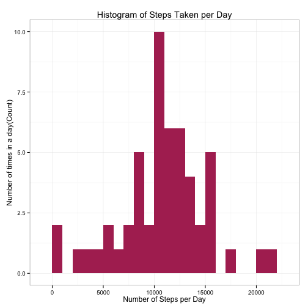
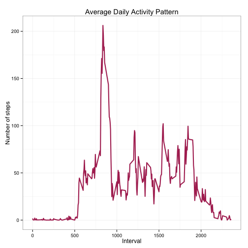
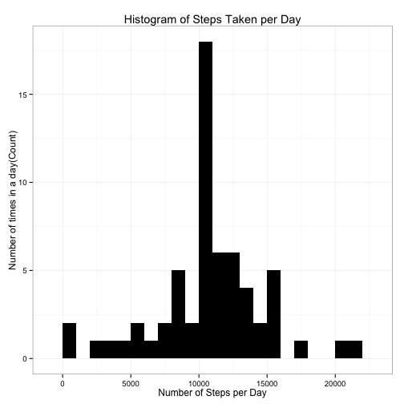
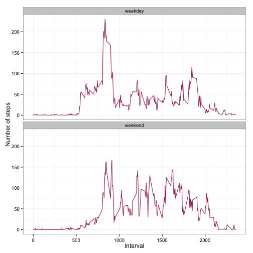

#"Reducible Research: Peer Assignment 1"
###author: "Joshua Freeman"
###date: "July 16, 2015"

##Introduction
This document is the results of 1st peer assessment for the course [Reproducible Research](https://class.coursera.org/repdata-036) on [Coursera](https://www.coursera.org/). The assessment uses data from a personal activity monitoring device (ex. Fitbit, Nike Fuelband, or Jawbone Up) collected in five minute intervals throughout the day during the months of October and November 2012.

The report is presented in a **single R markdown document** processed by knitr into a HTML file.

##Prepare the R environment
###Load Libraries


```r
library(data.table)
```

```
## data.table 1.9.4  For help type: ?data.table
## *** NB: by=.EACHI is now explicit. See README to restore previous behaviour.
```

```r
library(ggplot2) # we shall use ggplot2 for plotting figures
```

```
## Warning: package 'ggplot2' was built under R version 3.1.3
```

```r
library(knitr)
```

In this report **echo = true** so that the code is visible to everyone. 

```r
opts_chunk$set(echo = TRUE, results = 'hold')
```

##Loading and Preprocessing the Data
###Loading the Data
The data is read in using the read.csv() function.

```r
data <- read.csv('activity.csv', header = TRUE, sep = ",",
                  colClasses=c("numeric", "character", "numeric"))
```
**Note**:The function is written assumming the data is in the working directory.

###Preprocessing the Data
The date field is converted into a data class and the interval filed into a factor class. We also checked the data using the str() function.


```r
data$date <- as.Date(data$date, format = "%Y-%m-%d")
data$interval <- as.factor(data$interval)

str(data)
```

```
## 'data.frame':	17568 obs. of  3 variables:
##  $ steps   : num  NA NA NA NA NA NA NA NA NA NA ...
##  $ date    : Date, format: "2012-10-01" "2012-10-01" ...
##  $ interval: Factor w/ 288 levels "0","5","10","15",..: 1 2 3 4 5 6 7 8 9 10 ...
```

##Mean Total Steps taken Daily
Start by calculating the total steps per day.
**Note**:Ignoring the missing values in this step

```r
steps_per_day <- aggregate(steps ~ date, data, sum)
colnames(steps_per_day) <- c("date","steps")
head(steps_per_day)
```

```
##         date steps
## 1 2012-10-02   126
## 2 2012-10-03 11352
## 3 2012-10-04 12116
## 4 2012-10-05 13294
## 5 2012-10-06 15420
## 6 2012-10-07 11015
```


Next we create a **histogram** of the total daily steps.

```r
ggplot(steps_per_day, aes(x = steps)) + 
       geom_histogram(fill = "maroon", binwidth = 1000) + 
        labs(title="Histogram of Steps Taken per Day", 
             x = "Number of Steps per Day", y = "Number of times in a day(Count)") + theme_bw()
```

 

Finally we calculate the **mean** and **median** of the daily steps.

```r
steps_mean   <- mean(steps_per_day$steps, na.rm=TRUE)
steps_median <- median(steps_per_day$steps, na.rm=TRUE)
```
The Mean is 

```r
steps_mean
```

```
## [1] 10766.19
```
and the median is 

```r
steps_median
```

```
## [1] 10765
```
.

##Average Daily Activity Pattern

Aggregate the number of steps by 5-minute intervals as integers stored in the dataframe `steps_per_interval`.

```r
steps_per_interval <- aggregate(data$steps, 
                                by = list(interval = data$interval),
                                FUN=mean, na.rm=TRUE)
#convert to integers
##this helps in plotting
steps_per_interval$interval <- 
        as.integer(levels(steps_per_interval$interval)[steps_per_interval$interval])
colnames(steps_per_interval) <- c("interval", "steps")
```

Plot a time series (interval by steps).

```r
ggplot(steps_per_interval, aes(x=interval, y=steps)) +   
        geom_line(color="maroon", size=1) +  
        labs(title="Average Daily Activity Pattern", x="Interval", y="Number of steps") +  
        theme_bw()
```

 

Find the interval with the maximum number of steps.

```r
max_interval <- steps_per_interval[which.max(  
        steps_per_interval$steps),]
```

The max interval and steps for that interval are given below.

```r
max_interval 
```

```
##     interval    steps
## 104      835 206.1698
```

##Inputing Missing Values

###1.Total Number of Missing Values
Using is.na() the total number of missing values can be calculated, and also given below.

```r
missing_vals <- sum(is.na(data$steps))
missing_vals
```

```
## [1] 2304
```

###2.Filling in the Missing Values
We can use the mean value at the same interval across dates to fill in the missing values in the data.


```r
na_fill <- function(data, pervalue) {
        na_index <- which(is.na(data$steps))
        na_replace <- unlist(lapply(na_index, FUN=function(idx){
                interval = data[idx,]$interval
                pervalue[pervalue$interval == interval,]$steps
        }))
        fill_steps <- data$steps
        fill_steps[na_index] <- na_replace
        fill_steps
}

data_fill <- data.frame(  
        steps = na_fill(data, steps_per_interval),  
        date = data$date,  
        interval = data$interval)
str(data_fill)
```

```
## 'data.frame':	17568 obs. of  3 variables:
##  $ steps   : num  1.717 0.3396 0.1321 0.1509 0.0755 ...
##  $ date    : Date, format: "2012-10-01" "2012-10-01" ...
##  $ interval: Factor w/ 288 levels "0","5","10","15",..: 1 2 3 4 5 6 7 8 9 10 ...
```

Check again if there are any missing values left.


```r
sum(is.na(data_fill$steps))
```

```
## [1] 0
```
Showing no missing values.

###Histogram of Daily Steps
Here we plot a histogram with the missing data having been filled in.

```r
fill_steps_per_day <- aggregate(steps ~ date, data_fill, sum)
colnames(fill_steps_per_day) <- c("date","steps")

##plotting the histogram
ggplot(fill_steps_per_day, aes(x = steps)) + 
       geom_histogram(fill = "black", binwidth = 1000) + 
        labs(title="Histogram of Steps Taken per Day", 
             x = "Number of Steps per Day", y = "Number of times in a day(Count)") + theme_bw() 
```

 

###Mean and Median
Below are the mean and median for the steps taken with filled in data.

```r
steps_mean_fill   <- mean(fill_steps_per_day$steps, na.rm=TRUE)
steps_median_fill <- median(fill_steps_per_day$steps, na.rm=TRUE)

steps_mean_fill
steps_median_fill
```

```
## [1] 10766.19
## [1] 10766.19
```

####Difference between Mean and Median due to filled in data
The values do differ due to the filled in data.

Prefilled

```r
steps_mean
steps_median
```

```
## [1] 10766.19
## [1] 10765
```

Postfilled

```r
steps_mean_fill
steps_median_fill
```

```
## [1] 10766.19
## [1] 10766.19
```
The mean and median in the post filled are equal.

####Impact of inputting the missing data on Daily total number of steps
The means are unchanged by filling in the missing data and the median shifts to match the value of the mean. The data shows as a t-student distribution, and has increased the peak.

##Differences between the Weekdays and Weekends
Using the filled in data table we will:
  1.Subset the data into weekdays and weekends
  2.Average the steps per interval for each data set
  3.Plot the two data sets
  

```r
weekdays_steps <- function(data) {
    weekdays_steps <- aggregate(data$steps, by=list(interval = data$interval),
                          FUN=mean, na.rm=T)
    # convert to integers for plotting
    weekdays_steps$interval <- 
            as.integer(levels(weekdays_steps$interval)[weekdays_steps$interval])
    colnames(weekdays_steps) <- c("interval", "steps")
    weekdays_steps
}

data_by_weekdays <- function(data) {
    data$weekday <- 
            as.factor(weekdays(data$date)) # weekdays
    weekend_data <- subset(data, weekday %in% c("Saturday","Sunday"))
    weekday_data <- subset(data, !weekday %in% c("Saturday","Sunday"))

    weekend_steps <- weekdays_steps(weekend_data)
    weekday_steps <- weekdays_steps(weekday_data)

    weekend_steps$dayofweek <- rep("weekend", nrow(weekend_steps))
    weekday_steps$dayofweek <- rep("weekday", nrow(weekday_steps))

    data_by_weekdays <- rbind(weekend_steps, weekday_steps)
    data_by_weekdays$dayofweek <- as.factor(data_by_weekdays$dayofweek)
    data_by_weekdays
}

data_weekdays <- data_by_weekdays(data_fill)

ggplot(data_weekdays, aes(x=interval, y=steps)) + 
        geom_line(color="maroon") + 
        facet_wrap(~ dayofweek, nrow=2, ncol=1) +
        labs(x="Interval", y="Number of steps") +
        theme_bw()
```

 

As the graphs show, the weekdays have a period of higher intensity and then lower intensity for the rest of the time. The weekends do not have a period of higher intensity but have a higher average intensity. This suggests that during the weekdays there is a set schedule that must be kept (work) as compared to the weekend where the schedule might be more open to activity.


